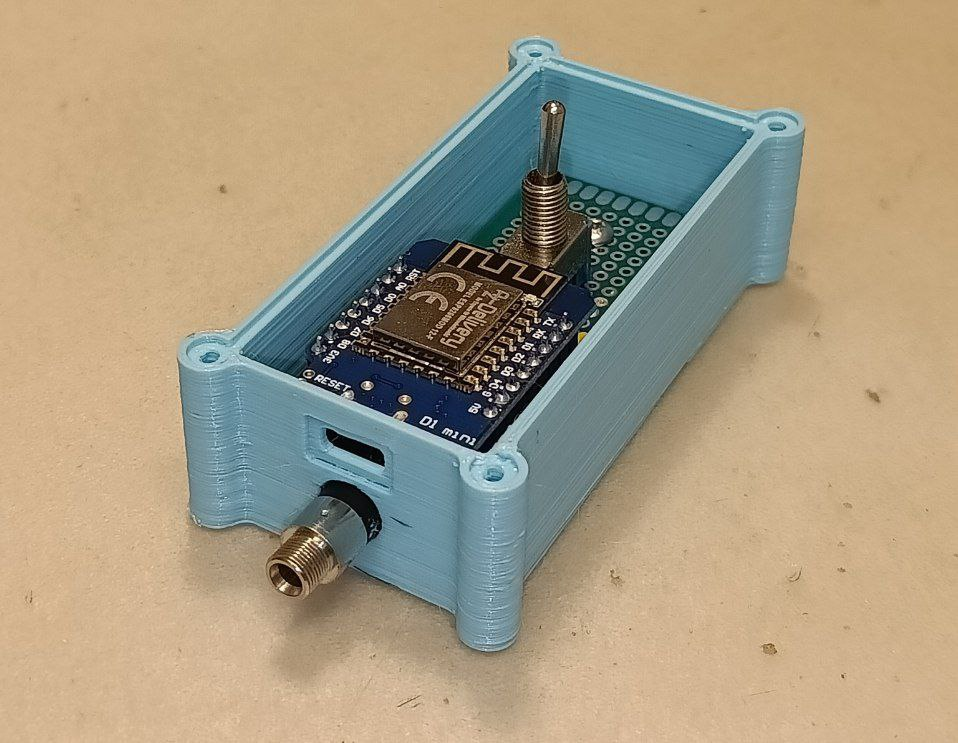

# Hacking a Mandolyn RC-710 RF Remote Power Socket

In this project, I hacked a budget-friendly Mandolyn RC-710 RF remote power socket to make it controllable via WiFi—in other words, to turn it into a "smart" power socket. Along the way, I reverse-engineered the RC-710's schematics, modified the PCB to safely allow external toggling of the built-in relay, and developed an ESP8266-based board that controls the relay wirelessly via TCP.

## Warning

The RC-710 is powered by an unisolated power supply. This means that when the device is powered from mains as intended, any low voltages measured on the board will still be at a potentially lethal voltage relative to earth ground. To stress this: Simply touching a pin labeled "0V GND" on the schematic will apply a dangerous voltage (at worst 325V DC) across your body! As we’ll explore, a 24V DC power supply can be connected to the board instead of mains for testing purposes, eliminating the risk of electric shock. However, it should be crystal clear: **Do not mess with this device unless you know exactly what you’re doing! I am not responsible for any damage or injury caused by attempting to replicate this project.** Even with my exprience, I am still endangering myself by working on this device.

## Motivation

### 1. The primary motivation: Laziness

We have a 230V powered IKEA lamp in our apartment. Sometimes, I’m just too lazy to get up and turn it off… Seriously, that’s the whole reason.

### 2. Why Not Just Buy a WiFi Smart Plug?

I could’ve bought a 10€ WiFi "smart plug," but I’m not thrilled with what’s out there. For one, I still like having a physical button or switch within easy reach to control the lamp. Most smart plugs I found only have a button directly on the plug. This can lead to awkward situations where you try to use the lamp’s built-in switch, but it doesn’t turn on because the smart plug is off. Having a separate, easily reachable button should avoid this issue.

The second reason is that I’m not a fan of the apps that come with these plugs. They often offer way more than I need. As you’ll see later, I’ve built my own app for this project that just shows a tappable photo of the lamp to toggle it on and off. Simple, straightforward, and tailored to my needs. Some might even call it an enterprise solution :)

### 3. Why not build something from scratch?

Hacking an existing remote power socket offers the advantage of a ready-made enclosure and a PCB that’s (hopefully) designed to handle the high voltages safely.

### 4. Why the Mandolyn RC-710?

We had a few of these lying around the lab, collecting dust. I figured it was time to give them a new purpose.

## About the Mandolyn RC-710

The RC-710 is a remote-controlled power socket that toggles on and off using a 433MHz RF remote, which comes bundled with the socket.

#### The power socket

The socket itself has two buttons: one to manually toggle the power on and off, and another to "learn" a new remote code. It also has a green LED that lights up when the socket is on.

#### The remote

The RF remote operates on up to four channels, each with its own unique 433MHz code. Each channel has an ON and an OFF button, allowing you to control multiple sockets independently. It also features two "Xanax-shaped" buttons: one to toggle all channels on or off simultaneously, and another to dim or brighten the connected device. The dimming function is not supported by the RC-710 and is intended for another model.

Since this project discards the RF remote in favor of WiFi control, we won’t be delving into the remote any further.

#### Availability

Not much information is available about these things. They’re sold under various brand names (e.g., Voltcraft Cost Control 3000), but the internals remain the same. I also believe they were once sold at Lidl.

## Reverse Engineering the RC-710

### Opening the RC-710

Opening up the RC-710 is pretty straightforward. Start by removing the six screws on the back, and the two halves of the enclosure will come apart easily. You might also need to press in the AC plug to release it from the enclosure.

Once inside, you'll see the top side of a simple one-sided PCB. The PCB is secured with four smaller screws. After removing these, you can lift the PCB out of the enclosure.

### Reverse Engineering the Schematic

I started by taking photos of both the top and bottom sides of the PCB, then overlapping them in GIMP. After adjusting the images, I managed to get the traces of both layers almost perfectly aligned. This setup allowed me to quickly toggle between the two layers by simply showing or hiding the top layer.

On a second screen, I opened up KiCAD to create a schematic. I began by adding symbols for all the components. From there, I started connecting the symbols according to the PCB's traces. When the images from GIMP didn’t provide enough detail, I used a multimeter to verify connections between components. After getting everything laid out, I was left with a rather messy schematic. The final step was to clean it up and make it more readable.

### The circuit

All-in all, the circuit can be summerized into 3 main parts: the power supply, the relay, and the RF receiver. Most of the device's functionality is handled by a mysterious blob IC.

#### Power Supply

The power supply circuit is as simple as it gets. The AC mains voltage is first rectified by a full-wave bridge rectifier. This rectified voltage is then regulated down to 24V DC using a Zener diode and a smoothing capacitor. The 24V DC is primarily used to power the relay. Finally, the 24V DC is further regulated down to 5V DC, again using a Zener diode and a smoothing capacitor, to supply power to the rest of the circuitry.

#### Relay

The relay's job is to switch the "live" line. To activate the relay, transistor Q2 is employed. Applying a 5V signal forward-biases Q2, which closes the circuit for the relay coil. This also turns on the indicator LED, as it is connected in series with the relay coil. When the relay is activated, it closes the "live" line.

The mysterious blob IC is responsible for controlling the relay by either pulling the transistor's base low or leaving it floating at 5V. When the device powers up, the IC's pin defaults to a floating state, meaning the relay circuit is closed and the device is enabled.

#### RF Receiver

The RF receiver is made up of a network of capacitors, inductors, and transistors. I haven’t delved too deeply into this section of the circuit, as it’s quite complex and not directly relevant to my objective. From what I can gather, the RF signal is amplified and then converted into a PWM signal by the LM358 Op-Amp (U1). It seems that the actual demodulation and decoding of the signal is entirely handled by the mysterious blob IC.

#### The blob IC

The mysterious blob IC serves as the brains of the device. It is powered by approx. 3V (regulated down from the 5V supply using diodes) and manages the "LEARN" and "ON/OFF" push-buttons, decodes and "learns" RF signals, and ultimately controls the relay by switching the transistor Q2.

## Modifying the RC-710

### Safety First

Before applying any modifications to the RC-710, I wanted to ensure that I could safely work on the device without the risk of electric shock. The RC-710 is powered by a 24V DC supply, which is derived from the mains voltage. To eliminate the risk of electric shock, I decided to power the device using a 24V DC power supply instead of mains by attaching the postive lead to the positive side of C12 and the negative lead to the negative side of C12 (GND). 

A 5V supply can theoretically also be used to power the device, but the relay will no longer be able to switch due to the insufficiently strong magnetic field.

### Hijacking the PCB

I set some straightforward rules and requirements for the project:

- The relay should be controllable via an external signal:
  - An ON signal should close the relay.
  - An OFF signal should open the relay.
- The state of the relay must be predictable:
  - The device's internal functions should not interfere with the external signal.
- The device's internal functionality does not need to be preserved.
- The external signal must be electrically isolated from the device.

To hijack the device, the first step was to find a simple way to disable the blob IC. That way I didn't have to worry about the device's internal functions interfering with the external signal. This was easily achieved by depraiving the blob IC of its power by desoldering diode D12. Later I also discovered that R22 also needed to be removed, as a high state on the OP-AMP’s output was somehow still providing enough power to the blob to pull down the base of the relay driver transistor Q2.

The next step was to enable external control of the relay transistor's base. I wanted to add a 2-pin connector to the device's case that could be used to control the relay. For safety, this connector needed to be electrically isolated from the rest of the device. To achieve this, I used a 4N25 optocoupler, which we had plenty of in the lab, and a 3.5mm headphone jack as the external connector.

The 4N25 optocoupler contains an NPN phototransistor. By connecting the phototransistor to the base of Q2, the base would be pulled down when the phototransistor is activated (disabling the relay) and left floating when it's off (enabling the relay). I chose a headphone jack as the connector because it’s a widely available standard, and long audio cables are inexpensive or easy to make.

To protect the "low voltage" side of the optocoupler, I also added a 220 Ohm current-limiting resistor. While the use of a headphone jack might tempt someone to connect an audio source to it, the high output impedance of audio devices, combined with the 220 Ohm resistor, should keep the optocoupler safe. In the worst-case scenario, it would just cause the relay to toggle rapidly.

After soldering the optocoupler to the PCB and the headphone jack, I secured the optocoupler inside the case with glue and fixed the headphone jack into the hole previously used for the "ON/OFF" push-button. I also used a JST XH 2-pin connector between the optocoupler and the PCB for the "hot" connection. This allows the PCB to still be easily removed from the case. For added safety, I applied plenty of electrical tape to any areas that could potentially expose the exterior to the device's mains voltage, even remotely.

Now the device was ready to be controlled externally. The next step was to design a board that could control the relay wirelessly via WiFi.

## WiFi Board

### Design

For the WiFi module, I used a D1 Mini ESP8266 board, along with a switch and a 3.5mm headphone jack. The switch allows manual toggling of the relay, while the headphone jack connects the board to the RC-710. Everything was soldered onto a perfboard and housed in a 3D-printed case. To power the board, the micro USB port on the D1 Mini is used.

### Firmware

The firmware for the ESP8266 is designed to be adaptable for various projects. In essence, the firmware simply converts TCP packets into GPIO signals.
It can be configured through the [config.h](firmware_wifiboard/src/config.h) file where you can adjust settings such as WiFi credentials, pin assignments, the type of physical input (switch, pushbutton, or none), action modes (ON/OFF, toggle, or pulse), and more.

As a small side note: I also used this firmware for another project where I control a USB-powered IKEA lamp via a transistor. In that case, instead of toggling a relay, the firmware controls the lamp's power through a transistor.

The ESP8266 primarily listens for TCP packets that trigger specific actions based on the configured "action mode." In this project, the action mode is set to ON/OFF, where a TCP message of `0x00` turns the relay off, and `0x01` turns it on. The ON/OFF mode also supports a "get" request (`0x03`), which returns the current state of the relay.

Aside from listening for TCP packets, the ESP8266 also mirrors the physical input to the relay. Any changes made to the relay's state through the physical input (e.g., a switch or button) are also updated in the firmware. This ensures that "get" requests always return the correct and current state of the relay.

## Mobile App

The final touch to this project was creating a simple Android mobile app to control the relay, and in my case, the lamp. The app features photos of my wirelessly controllable lamps, and tapping on a lamp's photo toggles it on or off. The app also visually indicates the lamp's state by lighting up the photo when the lamp is on.

I won’t be sharing the app’s source code because it’s tailored specifically to my setup and, honestly, it’s a bit messy since this was my first time developing an Android app.

## Conclusion

I am now left with a WiFi-controllable power socket. That's pretty cool I guess.